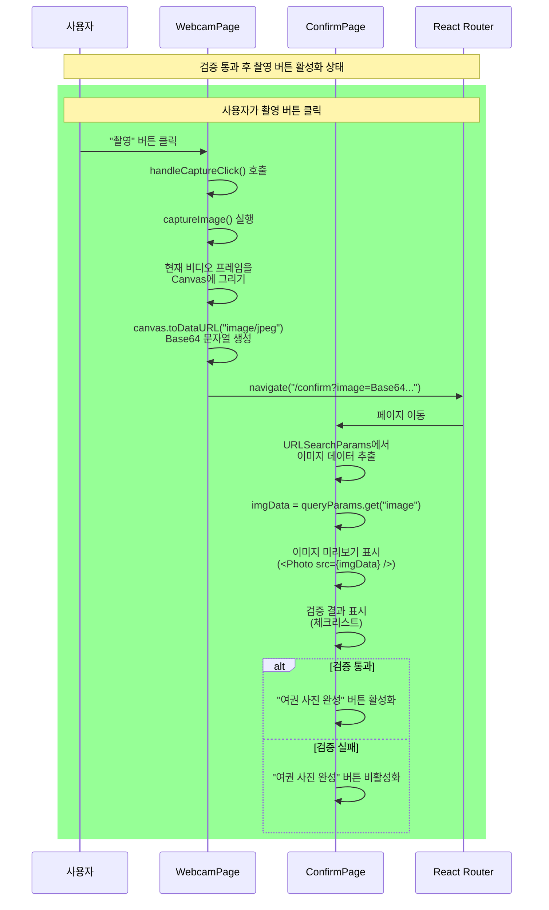
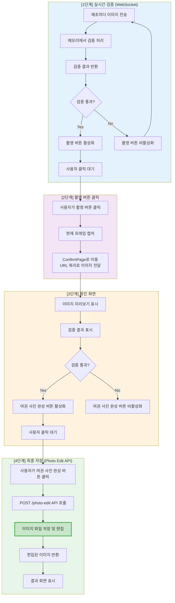

# 전체 시스템 시퀀스 다이어그램

## 전체 플로우 개요

```mermaid
sequenceDiagram
    participant User as 사용자
    participant WebcamPage as WebcamPage<br/>(촬영 화면)
    participant SocketGateway as Socket Gateway<br/>(실시간 검증)
    participant Memory as 메모리<br/>(RAM)
    participant ModelServer as 모델 서버<br/>(Python Flask)
    participant ConfirmPage as ConfirmPage<br/>(확인 화면)
    participant PhotoEditAPI as Photo Edit API<br/>(최종 저장)
    participant FileSystem as 파일 시스템<br/>(socket_temp/)

    Note over User,FileSystem: === [1단계] 실시간 검증 ===
    
    rect rgb(240, 245, 250)
        Note over User,FileSystem: 매초마다 반복 (실시간 검증)
        
        WebcamPage->>WebcamPage: 1초마다 captureAndSendFrame()
        WebcamPage->>WebcamPage: Canvas에서 이미지 추출<br/>(Base64)
        
        WebcamPage->>SocketGateway: WebSocket emit("stream", Base64-A)
        
        SocketGateway->>Memory: Base64-A 메모리 저장<br/>(파일 저장 없음)
        
        rect rgb(220, 220, 220)
            Note over Memory: 메모리: [Base64-A: 270KB]
        end
        
        SocketGateway->>SocketGateway: 임시 파일 저장 (.txt)<br/>(기존 코드)
        
        SocketGateway->>ModelServer: POST /process (Base64-A)
        
        rect rgb(90, 90, 90)
            Note over ModelServer: YOLO + MediaPipe<br/>검증 처리 중...
        end
        
        ModelServer-->>SocketGateway: 검증 결과 반환<br/>(tempVerificationResult)
        
        SocketGateway->>SocketGateway: 임시 파일 삭제
        
        SocketGateway->>SocketGateway: imageBlob 메모리 해제
        
        rect rgb(200, 255, 200)
            Note over Memory: 메모리: [해제됨: 0KB]
        end
        
        SocketGateway-->>WebcamPage: emit("stream", tempVerificationResult)
        
        WebcamPage->>WebcamPage: 검증 결과 표시<br/>(체크리스트 업데이트)
        
        alt 검증 실패
            WebcamPage->>WebcamPage: isValid = false<br/>촬영 버튼 비활성화
        else 검증 성공 (모든 항목 1)
            WebcamPage->>WebcamPage: isValid = true<br/>촬영 버튼 활성화
        end
    end
    
    Note over User,FileSystem: === [2단계] 촬영 버튼 클릭 ===
    
    rect rgb(245, 250, 245)
        Note over User,FileSystem: 사용자가 촬영 버튼 클릭
        
        User->>WebcamPage: "촬영" 버튼 클릭
        
        WebcamPage->>WebcamPage: captureImage() 호출<br/>(현재 비디오 프레임 캡처)
        
        WebcamPage->>WebcamPage: Canvas에서 이미지 추출<br/>(Base64)
        
        WebcamPage->>ConfirmPage: navigate("/confirm?image=Base64")
        Note over ConfirmPage: URL 쿼리 파라미터로<br/>이미지 전달
    end
    
    Note over User,FileSystem: === [3단계] 확인 화면 ===
    
    rect rgb(250, 245, 240)
        Note over User,FileSystem: ConfirmPage에서 이미지 확인
        
        ConfirmPage->>ConfirmPage: URL에서 이미지 추출<br/>(imgData)
        
        ConfirmPage->>ConfirmPage: 이미지 미리보기 표시
        
        ConfirmPage->>ConfirmPage: 검증 결과 표시<br/>(체크리스트)
        
        alt 검증 통과
            ConfirmPage->>ConfirmPage: "여권 사진 완성" 버튼 활성화
        else 검증 실패
            ConfirmPage->>ConfirmPage: "여권 사진 완성" 버튼 비활성화
        end
    end
    
    Note over User,FileSystem: === [4단계] 최종 저장 ===
    
    rect rgb(240, 255, 240)
        Note over User,FileSystem: 사용자가 "여권 사진 완성" 버튼 클릭
        
        User->>ConfirmPage: "여권 사진 완성" 버튼 클릭
        
        ConfirmPage->>ConfirmPage: handleCompleteClick()
        
        ConfirmPage->>ConfirmPage: Base64 → Blob 변환
        
        ConfirmPage->>ConfirmPage: FormData 생성
        
        ConfirmPage->>PhotoEditAPI: POST /photo-edit<br/>(multipart/form-data)
        
        rect rgb(150, 255, 150)
            Note over PhotoEditAPI: 💾 여기서만 파일 저장!
        end
        
        PhotoEditAPI->>PhotoEditAPI: 이미지 전처리
        
        PhotoEditAPI->>ModelServer: POST /crop<br/>(이미지 편집)
        
        ModelServer-->>PhotoEditAPI: 편집된 이미지 반환
        
        PhotoEditAPI->>PhotoEditAPI: 이미지 처리 완료
        
        PhotoEditAPI-->>ConfirmPage: 이미지 파일 반환 (blob)
        
        ConfirmPage->>ConfirmPage: Blob → ObjectURL 변환
        
        ConfirmPage->>ConfirmPage: navigate("/result?image=URL")
        
        Note over User,FileSystem: ✅ 최종 결과 화면 표시
    end
```



---

## 상세 시퀀스 다이어그램

### 실시간 검증 단계 (WebSocket)

```mermaid
sequenceDiagram
    participant WebcamPage as WebcamPage
    participant SocketGateway as Socket Gateway
    participant Memory as 메모리
    participant FileSystem as 파일 시스템<br/>(임시)
    participant ModelServer as 모델 서버
    
    Note over WebcamPage,ModelServer: 매초마다 실행되는 실시간 검증
    
    rect rgb(240, 245, 250)
        Note over WebcamPage,ModelServer: 0초: 첫 번째 검증 요청
        
        WebcamPage->>WebcamPage: setInterval(captureAndSendFrame, 1000)
        WebcamPage->>WebcamPage: Canvas에서 이미지 캡처<br/>(toDataURL)
        
        WebcamPage->>SocketGateway: emit("stream", { image: Base64-A })
        
        SocketGateway->>SocketGateway: Base64 문자열 추출<br/>(imageBlob)
        
        SocketGateway->>Memory: Base64-A 메모리 저장
        
        rect rgb(220, 220, 220)
            Note over Memory: 메모리: [Base64-A: 270KB]
        end
        
        SocketGateway->>FileSystem: 임시 파일 저장 (.txt)<br/>⚠️ 기존 코드 유지
        
        SocketGateway->>ModelServer: POST /process (Base64-A)
        
        rect rgb(90, 90, 90)
            Note over ModelServer: base64.b64decode()<br/>io.BytesIO()<br/>Image.open()<br/>YOLO + MediaPipe 처리
        end
        
        ModelServer-->>SocketGateway: 검증 결과 반환<br/>({ yolo_results, mediapipe_results })
        
        SocketGateway->>SocketGateway: processResult()<br/>검증 결과 처리
        
        SocketGateway->>FileSystem: 임시 파일 삭제
        
        SocketGateway->>Memory: imageBlob = null<br/>(메모리 해제)
        
        rect rgb(200, 255, 200)
            Note over Memory: 메모리: [해제됨: 0KB]
        end
        
        SocketGateway-->>WebcamPage: emit("stream", { tempVerificationResult })
        
        WebcamPage->>WebcamPage: 검증 결과 업데이트<br/>setVerificationResult()
        
        alt 모든 검증 통과 ([1,1,1,1,1])
            WebcamPage->>WebcamPage: isValid = true<br/>촬영 버튼 활성화
        else 검증 실패
            WebcamPage->>WebcamPage: isValid = false<br/>촬영 버튼 비활성화
        end
    end
    
    rect rgb(245, 250, 245)
        Note over WebcamPage,ModelServer: 1초: 두 번째 검증 요청
        
        WebcamPage->>SocketGateway: emit("stream", { image: Base64-B })
        
        SocketGateway->>Memory: Base64-B 메모리 저장
        
        rect rgb(220, 220, 220)
            Note over Memory: 메모리: [Base64-B: 270KB]
        end
        
        SocketGateway->>FileSystem: 임시 파일 저장
        
        SocketGateway->>ModelServer: POST /process (Base64-B)
        
        ModelServer-->>SocketGateway: 검증 결과 반환 (실패)
        
        SocketGateway->>FileSystem: 임시 파일 삭제
        
        SocketGateway->>Memory: imageBlob = null
        
        rect rgb(200, 255, 200)
            Note over Memory: 메모리: [해제됨: 0KB]
        end
        
        SocketGateway-->>WebcamPage: emit("stream", { tempVerificationResult: [0,1,1,0,1] })
        
        WebcamPage->>WebcamPage: isValid = false<br/>촬영 버튼 비활성화
    end
```



---

### 촬영 버튼 클릭 → 확인 화면 단계



---

### 최종 저장 단계 (Photo Edit API)

```mermaid
sequenceDiagram
    participant User as 사용자
    participant ConfirmPage as ConfirmPage
    participant PhotoEditAPI as Photo Edit API<br/>(NestJS)
    participant ModelServer as 모델 서버<br/>(Python Flask)
    participant FileSystem as 파일 시스템<br/>(필요시)
    
    Note over User,FileSystem: ConfirmPage에서 최종 확인 후
    
    rect rgb(240, 255, 240)
        Note over User,FileSystem: 사용자가 "여권 사진 완성" 버튼 클릭
        
        User->>ConfirmPage: "여권 사진 완성" 버튼 클릭
        
        ConfirmPage->>ConfirmPage: handleCompleteClick() 실행
        
        ConfirmPage->>ConfirmPage: base64ToBlob(imgData)<br/>Base64 → Blob 변환
        
        ConfirmPage->>ConfirmPage: FormData 생성<br/>formData.append("image", blob)
        
        ConfirmPage->>ConfirmPage: setIsProcessing(true)<br/>로딩 모달 표시
        
        ConfirmPage->>PhotoEditAPI: POST /photo-edit<br/>(multipart/form-data)
        
        rect rgb(150, 255, 150)
            Note over PhotoEditAPI: 💾 여기서만 파일 저장!
        end
        
        PhotoEditAPI->>PhotoEditAPI: FileInterceptor로<br/>이미지 파일 수신
        
        PhotoEditAPI->>PhotoEditAPI: preProcessImage()<br/>이미지 전처리
        
        PhotoEditAPI->>ModelServer: POST /crop<br/>(FormData with image file)
        
        rect rgb(90, 90, 90)
            Note over ModelServer: 이미지 편집 처리<br/>(얼굴 크롭 등)
        end
        
        ModelServer-->>PhotoEditAPI: 편집된 이미지 반환<br/>(PNG 바이너리)
        
        PhotoEditAPI->>PhotoEditAPI: 이미지 처리 완료
        
        PhotoEditAPI-->>ConfirmPage: 이미지 파일 반환<br/>(responseType: "blob")
        
        ConfirmPage->>ConfirmPage: URL.createObjectURL(res.data)
        
        ConfirmPage->>ConfirmPage: setIsProcessing(false)<br/>로딩 모달 닫기
        
        ConfirmPage->>ConfirmPage: navigate("/result?image=blobURL")
        
        Note over User,FileSystem: ✅ 최종 결과 화면 표시
    end
```



---

## 전체 플로우 요약 다이어그램



---

## 주요 포인트

### ✅ WebSocket 단계 (실시간 검증)
- **목적**: 실시간 검증 결과 제공
- **파일 저장**: ❌ 저장하지 않음 (메모리에서만 처리)
- **임시 파일**: 기존 코드 유지 (저장 후 삭제)
- **메모리 관리**: 검증 완료 후 즉시 해제

### ✅ 촬영 버튼 클릭 단계
- **트리거**: 사용자가 "촬영" 버튼 클릭
- **동작**: 현재 비디오 프레임을 캡처하여 ConfirmPage로 전달
- **파일 저장**: ❌ 저장하지 않음 (URL 쿼리로 전달)

### ✅ 확인 화면 단계
- **목적**: 사용자가 최종 확인
- **파일 저장**: ❌ 저장하지 않음 (메모리에서만 표시)

### ✅ Photo Edit API 단계 (최종 저장)
- **트리거**: 사용자가 "여권 사진 완성" 버튼 클릭
- **파일 저장**: ✅ 여기서만 파일 저장 및 편집
- **결과**: 편집된 이미지 반환

---

## 메모리 사용 패턴

| 단계 | 메모리 사용 | 파일 저장 | 설명 |
|------|------------|----------|------|
| WebSocket 검증 | ✅ Base64 저장 | ❌ 없음 | 검증 후 즉시 해제 |
| 촬영 버튼 클릭 | ✅ Base64 전달 | ❌ 없음 | URL 쿼리로 전달 |
| 확인 화면 | ✅ Base64 표시 | ❌ 없음 | 미리보기만 표시 |
| Photo Edit API | ✅ Blob 처리 | ✅ 파일 저장 | 여기서만 저장 |

---

## 시간 흐름 예시

```
0초:   WebSocket 검증 시작 (Base64-A)
       → 메모리: [270KB]
       → 검증 실패 → 메모리 해제

1초:   WebSocket 검증 (Base64-B)
       → 메모리: [270KB]
       → 검증 실패 → 메모리 해제

2초:   WebSocket 검증 (Base64-C)
       → 메모리: [270KB]
       → 검증 성공 → 메모리 해제
       → 촬영 버튼 활성화

3초:   사용자가 촬영 버튼 클릭
       → 현재 프레임 캡처 (Base64-D)
       → ConfirmPage로 이동

4초:   ConfirmPage에서 이미지 확인
       → Base64-D 표시 (메모리)

5초:   사용자가 "여권 사진 완성" 버튼 클릭
       → POST /photo-edit
       → ✅ 파일 저장 및 편집
       → 결과 화면 표시
```

이 구조로 메모리 사용을 최소화하고, 실제 파일 저장은 사용자가 최종 확인 후에만 수행됩니다.

