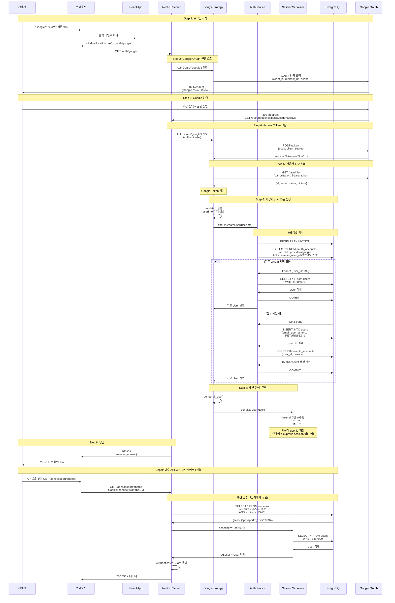
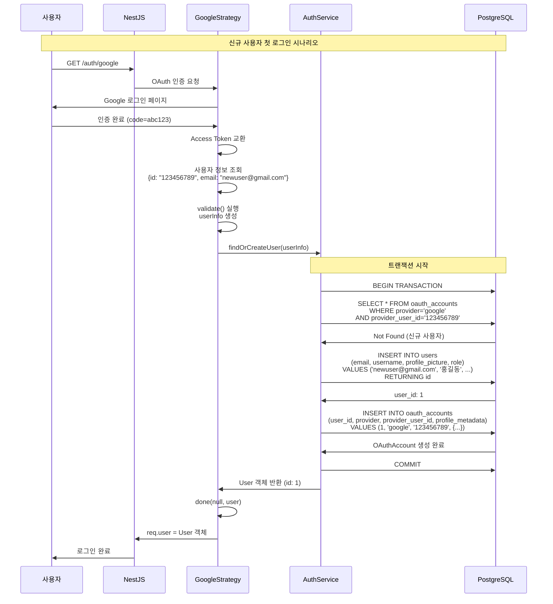
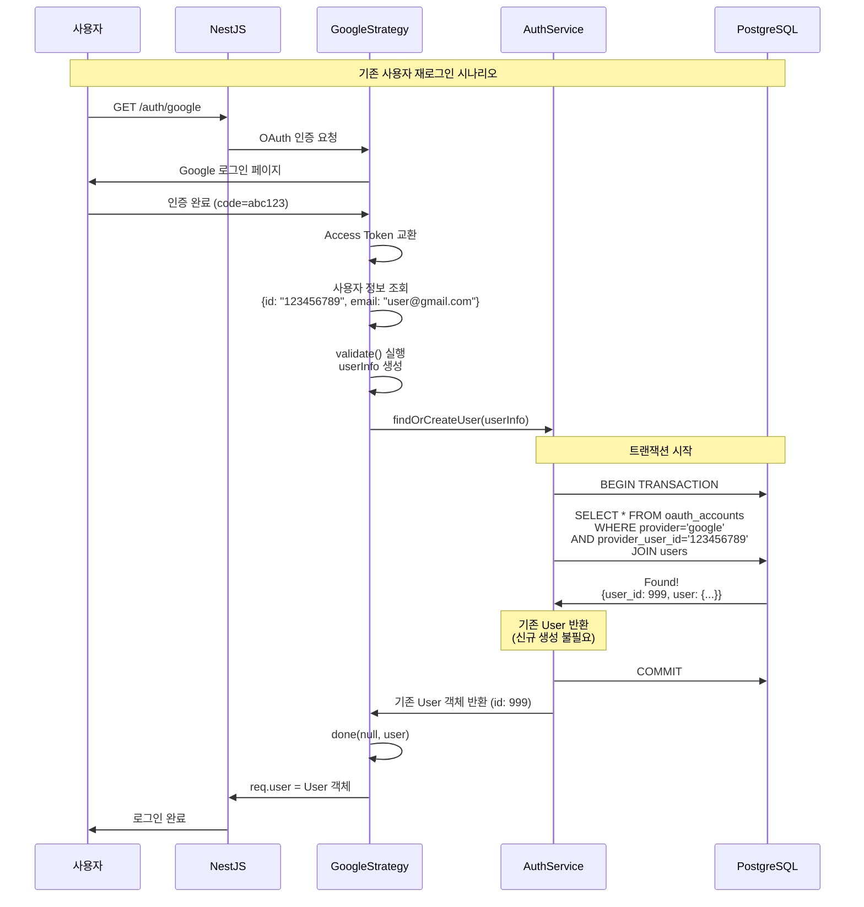
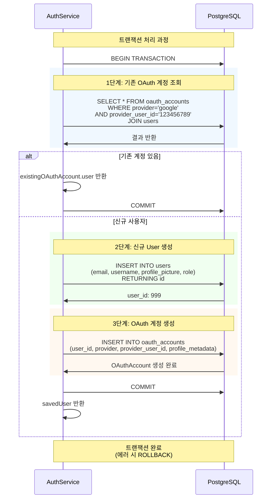

# Google OAuth 로그인 플로우 Sequence Diagram

## 전체 플로우 개요

## 상세 플로우: 신규 사용자 로그인

## 상세 플로우: 기존 사용자 재로그인

## 데이터베이스 트랜잭션 상세

## 주요 포인트

### 1. 완전 분리 방식
- `provider` + `provider_user_id`만으로 식별
- 이메일 기반 통합 로직 없음
- 같은 사람이라도 다른 OAuth 제공자로 로그인하면 별도 User 생성

### 2. 트랜잭션 보장
- `BEGIN TRANSACTION`으로 시작
- User 생성 실패 시 OAuthAccount 생성도 롤백
- 데이터 일관성 보장

### 3. 세션 준비
- `SessionSerializer.serializeUser()`로 `user.id`만 저장 준비
- 3단계에서 `express-session` 설정 후 실제 세션 생성

### 4. Google Token 처리
- Access Token은 사용 후 즉시 폐기
- 우리 서버에서는 세션만 사용

